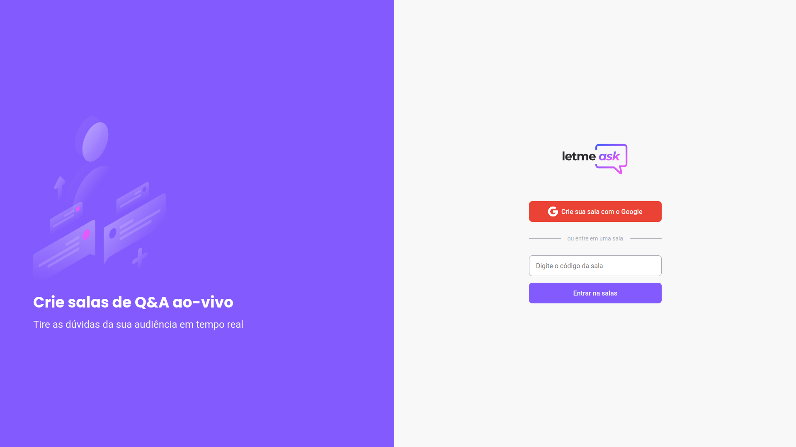

<h1 align="center">
  
</h1>

  <a href="#-tecnologias">Tecnologias</a>&nbsp;&nbsp;&nbsp;|&nbsp;&nbsp;&nbsp;
  <a href="#-projeto">Projeto</a>&nbsp;&nbsp;&nbsp;|&nbsp;&nbsp;&nbsp;
  <a href="#-layout">Layout</a>&nbsp;&nbsp;&nbsp;|&nbsp;&nbsp;&nbsp;
  <a href="#-como-executar">Como executar</a>

 

 

  

## ✨ Tecnologias

Esse projeto foi desenvolvido com as seguintes tecnologias:

- [React](https://reactjs.org)
- [Firebase](https://firebase.google.com/)
- [TypeScript](https://www.typescriptlang.org/)
- [Sass](https://sass-lang.com/)

## 💻 Projeto

O Letmeask é um plataforma para criadores de conteúdos poderem criar salas de perguntas e respostas com seu público durante uma transmissão, trazendo organização e interação.

Este é um projeto desenvolvido durante a [Next Level Week Together](https://nextlevelweek.com/), apresentada dos dias 20 a 27 de Junho de 2021.

## 🔖 Layout

Você pode visualizar o layout do projeto através [desse link](https://www.figma.com/file/u0BQK8rCf2KgzcukdRRCWh/Letmeask/duplicate). É necessário ter conta no [Figma](http://figma.com/) para acessá-lo.

## 🚀 Como executar

- Clone o repositório
- Instale as dependências com `yarn`
- Inicie o servidor com `yarn start`

Agora você pode acessar [`localhost:3000`](http://localhost:3000) do seu navegador.

Vale ressaltar que é necessário criar uma conta no [Firebase](https://firebase.google.com/) e um projeto para disponibilizar um Realtime Database. 

---

Feito com ♥ by Rocketseat e Rafael 👋🏻 